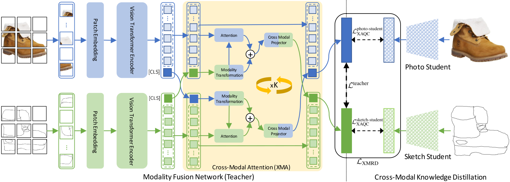

# Cross-Modal Fusion Distillation for Fine-Grained Sketch-Based Image Retrieval
Official implementation of
"[Cross-Modal Fusion Distillation for Fine-Grained Sketch-Based Image Retrieval](https://arxiv.org/abs/2210.10486)", BMVC 2022.

Our framework retains semantically relevant modality-specific features by learning a fused representation space,
while bypassing the expensive cross-attention computation at test-time via cross-modal knowledge distillation.



## Environment Setup

This project is implemented using PyTorch. A conda environment with all related dependencies can be created as follows:
1. Clone the project repository:
```shell
git clone https://github.com/abhrac/xmodal-vit.git
cd xmodal-vit
```
2. Create and activate conda environment:
```shell
conda env create -f environment.yml
conda activate xmodal-vit
```

## Experimentation

To run the whole train-test pipeline end-to-end, run:
```shell
./run_expt.sh
```
### Training
To train individual components from scratch, run the following:
```shell
python src/train_teacher.py --dataset=DatasetName
python src/train_photo_student.py --dataset=DatasetName
python src/train_sketch_student.py --dataset=DatasetName
```
where ```DatasetName``` is one of ShoeV2, ChairV2 or Sketchy.

### Evaluation
Pre-trained models are available [here](https://drive.google.com/drive/folders/1yf_ydvZAbF3kPkL3sR8841CroO4La3i9?usp=sharing).
To evaluate a trained model, run:
```shell
python src/test.py --dataset=DatasetName
```

## Results
| | **Shoe-V2** | **Shoe-V2** | **Chair-V2** | **Chair-V2** |
|:-|:-:|:-:|:-:|:-:|
||**Acc@1**|**Acc@10**|**Acc@1**|**Acc@10**|**Acc@1**|**Acc@10**|
|Yang *et al.*, ICCV '21| 32.33 | 79.63|52.89|94.88|
|Sain *et al.*, CVPR '21| 36.47 | 81.83|62.86|91.14|
|Bhunia *et al.*, CVPR '21| 39.10 | 87.50|62.20|90.80|
|Chowdhury *et al.*, CVPR '22| 39.90 | 82.90|-|-|
|Bhunia *et al.*, CVPR '22| 43.70 |-|**64.80**|-|
|**Ours (XModalViT)**| **45.05** | **90.23**|63.48|**95.02**|

| | **Sketchy** | **Sketchy**
|:-|:-:|:-:|
||**Acc@1**|**Acc@10**|
|Human (Sangkloy *et al.*, SIGGRAPH'16)|54.27|-|
|Pang *et al.*, BMVC'17|50.14|-|
|Wang *et al.*, PR'20 (S+I)|40.16|92.00|
|Wang *et al.*, PR'20 (S+I+D)|46.20|96.49|
|**Ours (XModalViT)**|**56.15**|**96.86**|

## Citation
```
@inproceedings{Chaudhuri2022XModalViT,
 author = {Abhra Chaudhuri, Massimiliano Mancini, Yanbei Chen, Zeynep Akata, Anjan Dutta},
 booktitle = {Proceedings of the British Machine Vision Conference (BMVC)},
 title = {Cross-Modal Fusion Distillation for Fine-Grained Sketch-Based Image Retrieval},
 year = {2022}
}
